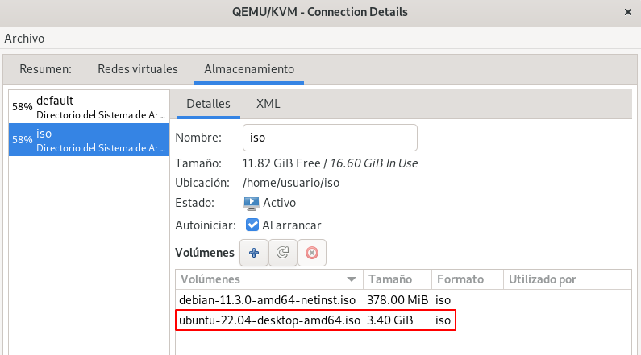

# Creación de máquinas virtuales Windows

Para crear una nueva máquina virtual con virt-manager podemos escoger la opción de menú **Archivo -> Nueva máquina virtual**, o el botón del menú:

El proceso que vamos a seguir sería similar al de la creación de una máquina virtual con el sistema operativo Linux, pero en este apartado vamos a hacer una instalación de Windows en la nueva máquina virtual. La diferencia entre Windows y Linux, es que tenemos que tener en cuenta que Windows no tiene soporte nativo para dispositivos VirtIO. Por lo tanto, a la hora de crear una máquina virtual Windows tendremos que añadir los controladores de dispositivos (drivers) necesarios para que Windows identifique los dispositivos VirtIO que definamos en la máquina virtual.

En este caso, el proyecto Fedora proporciona controladores de dispositivos de software libre para VirtIO en Windows.

## ISO de los controladores de dispositivo VirtIO para Windows

Podemos bajar la última versión de los drivers VirtIO para Windows en el siguiente [enlace](https://fedorapeople.org/groups/virt/virtio-win/direct-downloads/stable-virtio/virtio-win.iso) y copiar la ISO al pool de almacenamiento ISO, es decir, en el directorio `~/iso`. También hemos copiado a ese directorio una ISO para la instalación de Windows 10.

## Elegir la fuente de instalación del sistema operativo

## Seleccionar la ISO de instalación

## Configuración de memoria y de VCPU

## Seleccionar almacenamiento

## Resumen y selección de red

