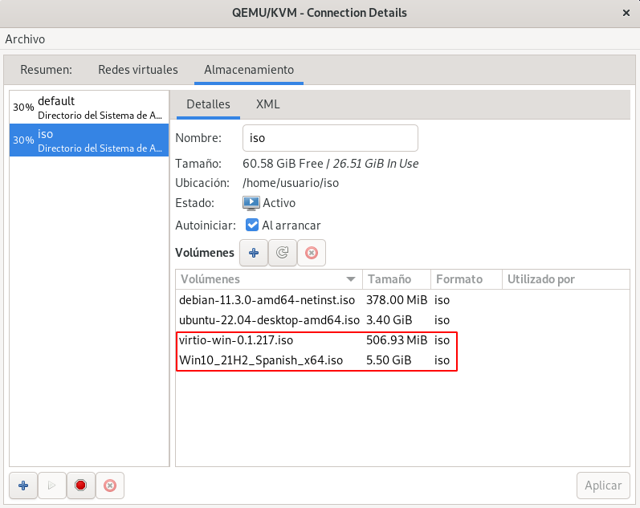

# Creación de máquinas virtuales Windows

En un apartado anterior hemos visto los pasos fundamentales para la creación de una máquina virtual Linux. Para crear una máquina virtual con un sistema operativo tipo Windows se siguen los mismos pasos, pero tenemos que tener en cuenta que Windows no tiene soporte nativo para dispositivos VirtIO. Por lo tanto, a la hora de crear una máquina virtual Windows tendremos que añadir los controladores de dispositivos (drivers) necesarios para que Windows identifique los dispositivos VirtIO que definamos en la máquina virtual.

En este caso, el proyecto Fedora proporciona controladores de dispositivos de software libre para VirtIO en Windows.

## ISO de los controladores de dispositivo VirtIO para Windows

Podemos bajar la última versión de los drivers VirtIO para Windows en el siguiente [enlace](https://fedorapeople.org/groups/virt/virtio-win/direct-downloads/stable-virtio/virtio-win.iso) y copiar la ISO al pool de almacenamiento ISO, es decir, en el directorio `~/iso`. También hemos copiado a ese directorio una ISO para la instalación de Windows 10.

Creamos la nueva máquina virtual Windows

Teniendo en cuenta los siguiente:

* Elegimos una imagen ISO para instalar una versión de Windows y seleccionamos la variante del sistema operativo que estamos instalando.
* Configuramos la CPU y la RAM para tener recursos suficientes.
* Como estamos instalando un sistema operativo Windows, *virt-manager* va a configurar los dispositivos para que sean compatibles con el sistema operativo. En concreto, el driver del disco y de la tarjeta de red no serán VirtIO, con lo que no conseguiremos el rendimiento adecuado. Por lo tanto, antes de realizar la instalación vamos a cambiar el tipo de driver de estos dispositivos, escogiendo **VirtIO** para obtener el máximo de rendimiento. 

En la pantalla final del asistente de creación de la máquina virtual, escogeremos la opción **Personalizar la configuración antes de instalar**:

