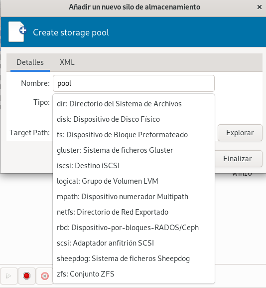

# Introducción al almacenamiento en QEMU/KVM + libvirt

Libvirt proporciona la gestión del almacenamiento a través de **pools de almacenamiento** y **volúmenes**.

* **Pools de Almacenamiento**: Es una fuente de almacenamiento, una cantidad de almacenamiento que el administrador del host ha configurado para su uso por las máquinas virtuales.
* **Volúmenes**: Los pools de almacenamiento se dividen en volúmenes. Cada uno de estos volúmenes lo utilizaran las máquinas virtuales como discos (dispositivos de bloques).

## Tipos de Pools de Almacenamiento

Tenemos la posibilidad de usar distintas tecnologías de almacenamiento para crear los distintos **tipos de Pools de Almacenamiento**. Cada una de las tecnologías de almacenamiento que usemos, nos podrá dar algunas de las siguientes características:

* Tipo de almacenamiento: Podremos trabajar con **Sistemas de Ficheros**, que nos permitirán el acceso a parte del sistema de fichero, o con **Dispositivos de Bloque**, gestionando de forma completa un dispositivo *en bruto*, un disco, que el sistema podrá particionar, formatear y utilizar.
* **Almacenamiento compartido**: Algunas de las fuentes de almacenamiento que podemos usar tienen la característica de poder compartir la información entre distintos servidores que tengan instalado QEMU/KVM + libvirt. En el caso que utilicemos estos tipos de almacenamiento tendremos a nuestra disposición la funcionalidad de **migración en vivo** de máquinas virtuales. Si no tenemos esta característica, la migración de máquinas entre distintos servidores de virtualización conllevará la copia de la imagen del disco entre los servidores.
* **Snapshots**: Algunas de las fuentes de almacenamiento que podemos usar tienen la característica de poder realizar instantáneas (snapshots). De esta manera podremos guardar el estado de un disco en un determinado momento, y si es necesario podremos volver a ese estado a posteriori.
* **Aprovisionamiento ligero**: Todas las fuentes de almacenamiento que nos permiten la realización de instantáneas, también nos proporcionan la funcionalidad del **aprovisionamiento ligero**. Con esta característica, tendremos mucho ahorro en espacio ocupado de almacenamiento, ya que aunque indicamos un tamaño grande de disco, realmente sólo se irá ocupando en disco la información que la máquina vaya necesitando.
	Por ejemplo, podemos crear una máquina virtual con un disco duro de 32 GB y, después de instalar el sistema operativo invitado, el sistema de archivos raíz de la máquina virtual contiene 3 GB de datos. En ese caso, solo se escriben 3 GB en el almacenamiento, aunque la máquina virtual ve un disco duro de 32 GB.

## Ejemplos de tipos de Pools de Almacenamiento

Veamos algunos de los tipos de almacenamiento con los que podemos trabajar:

* **dir**: El tipo **Directorio** nos ofrece un directorio del host (por lo tanto, nos ofrece un sistema de archivo). Este tipo no nos ofrece la característica de almacenamiento compartido. Los discos de las máquinas virtuales se guardaran en ficheros de imagen de disco. Tenemos distintos formatos de ficheros de imágenes:
	* **raw**: el formato raw es una imagen binaria sencilla de la imagen del disco. Se ocupa todo el espacio que hayamos indicado al crearla. El acceso es más eficiente. No soporta ni snapshots ni aprovisionamiento ligero.
    * **qcow2**: formato QEMU copy-on-write. Al crearse sólo se ocupa el espacio que se está ocupando con los datos (aprovisionamiento ligero), el fichero irá creciendo cuando escribamos en el él. Acepta instantáneas o snapshots. Es menos eficiente en cuanto al acceso.
    * **vdi, vmdk,...**: formatos de otros sistemas de virtualización.

	En un Pool de Almacenamiento de tipo **dir**, los **volúmenes** son ficheros de imágenes de disco. Los Pools de Almacenamiento con lo que hemos trabajado hasta ahora (`default` y `iso`) son de este tipo.

* **logical**: En este caso, utilizamos LVM (Logical Volume Manager). El Pool de Almacenamiento controlará un Grupo de Volúmenes, y los **volúmenes** (los discos de las máquinas virtuales) serán volúmenes lógicos que se crearán en el grupo de volúmenes. Este tipo de almacenamiento no ofrece la compartición, si admite los snapshots y puede utilizar aprovisionamiento ligero si utilizamos LVM-Thin.
* **netfs**: Este tipo de Pool de Almacenamiento montará un directorio desde un servidor NAS (nfs, glusterfs, cifs,...). Por lo tanto obtendremos la característica de compartición y de migración en vivo. Los **volúmenes** serán ficheros de imágenes de disco.

## Conclusiones

Tenemos la posibilidad de crear distintos tipos de Pools de Almacenamiento, que nos ofrecen distintas características. Podemos ver los distintos tipos al crear un Pool desde virt-manager:

En este curso vamos a trabajar con los Pool de Almacenamiento de tipo **dir**. Si quieres profundizar en las características de los distintos tipos de almacenamiento puedes ver la documentación oficial: [Storage Management](https://libvirt.org/storage.html).
