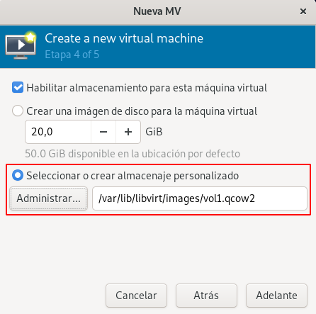

# Trabajar con volúmenes en las máquinas virtuales

En al creación de las máquinas virtuales que estudiamos en el módulo anterior, se creaba el volumen que se asociaba a la máquina como disco principal.

Sin embargo, en este apartado vamos a aprender algunas cosas nuevas: a crear nuevas máquinas virtuales pero usando volúmenes que hayamos creado anteriormente, a añadir nuevos discos a las máquinas virtuales y a redimensioanrlos para aumentar el espacio de almacenamiento.

## Creación de máquinas virtuales con volúmenes existentes

En apartados anterior creamos un volumen de 10Gb llamado `vol1.qcow2`. Vamos a crear una nueva máquina virtual que tenga como disco duro este volumen.

Si los hacemos con `virt-install`:

```
virt-install --connect qemu:///system \
			 --virt-type kvm \
			 --name prueba4 \
			 --cdrom ~/iso/debian-11.3.0-amd64-netinst.iso \
			 --os-variant debian10 \
			 --disk vol=default/vol1.qcow2 \
			 --memory 1024 \
			 --vcpus 1
```			 

Hemos utilizado la opción `--disk vol=default/vol1.qcow2`, indicando el volumen usando el formato `/pool/volumen`. Otras opciones que podríamos poner serían:

* `--disk path=/var/lib/libvirt/images/vol1.qcow2`: Donde indicamos directamente la ruta donde se encuentra el fichero de imagen de disco.
* `--pool wm-images,size=10`: En este caso no se reutiliza el volumen que tenemos creado, sino que se crearía un nuevo volumen de 10GB en el pool indicado.

Si utilizamos `virt-manager`, para crear la nueva máquina, durante el asistente de creación de la máquina, podemos escoger el volumen que tenemos creado:



## Añadir nuevos discos a máquinas virtuales

## Redimensión de discos en máquinas virtuales
