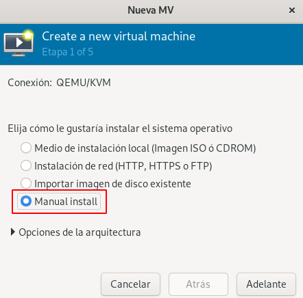
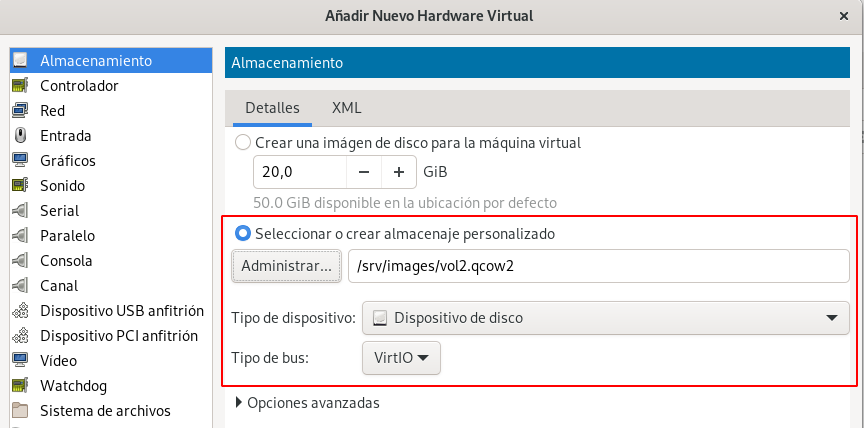
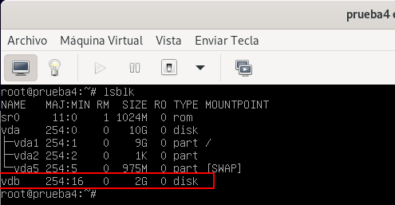
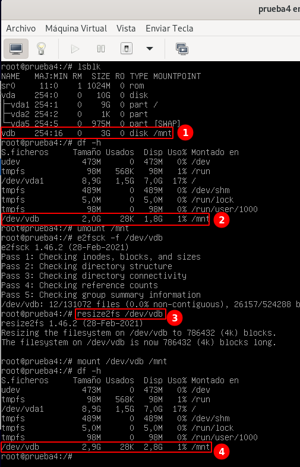

# Trabajar con volúmenes en las máquinas virtuales

En al creación de las máquinas virtuales que estudiamos en el módulo anterior, se creaba el volumen que se asociaba a la máquina como disco principal.

Sin embargo, en este apartado vamos a aprender algunas cosas nuevas: a crear nuevas máquinas virtuales pero usando volúmenes que hayamos creado anteriormente, a añadir nuevos discos a las máquinas virtuales y a redimensioanrlos para aumentar el espacio de almacenamiento.

## Creación de máquinas virtuales con volúmenes existentes

En apartados anterior creamos un volumen de 10Gb llamado `vol1.qcow2`. Vamos a crear una nueva máquina virtual que tenga como disco duro este volumen.

Si los hacemos con `virt-install`:

```
virt-install --connect qemu:///system \
			 --virt-type kvm \
			 --name prueba4 \
			 --cdrom ~/iso/debian-11.3.0-amd64-netinst.iso \
			 --os-variant debian10 \
			 --disk vol=default/vol1.qcow2 \
			 --memory 1024 \
			 --vcpus 1
```			 

Hemos utilizado la opción `--disk vol=default/vol1.qcow2`, indicando el volumen usando el formato `pool/volumen`. Otras opciones que podríamos poner serían:

* `--disk path=/var/lib/libvirt/images/vol1.qcow2`: Donde indicamos directamente la ruta donde se encuentra el fichero de imagen de disco.
* `--pool wm-images,size=10`: En este caso no se reutiliza el volumen que tenemos creado, sino que se crearía un nuevo volumen de 10GB en el pool indicado.

Si utilizamos `virt-manager`, para crear la nueva máquina, durante el asistente de creación de la máquina, elegimos la opción **Manual install**, ya que no vamos a usar una imagen ISO:



Y posteriormente, escogemos el volumen que tenemos creado:


## Añadir nuevos discos a máquinas virtuales

Para añadir un disco a una máquina virtual. vamos a modificar su definición XML. Podríamos usar `virsh edit` e incluir la definición XML del nuevo disco. Sin embargo, vamos a usar un comando de `virsh` que nos facilita la operación de añadir un nuevo disco y por tanto, la modificación de la definción XML de la máquina. Hay que indicar que esta modificación se puede hacer "en caliente", con la máquina funcionando.

Por lo tanto, vamos añadir el volumen `vol2.qcow2` que creamos en el apartado anterior, a la máquina que hemos creado en estado de ejecución, ejecutamos:

```
virsh -c qemu:///system attach-disk prueba4 /srv/images/vol2.qcow2 vdb --driver=qemu --type disk --subdriver qcow2 --persistent
El disco ha sido asociado exitosamente
```

Indicamos el nombre de la máquina, el path del fichero de imagen, el dispositivo de bloque que se va a crear, indicamos el driver, el tipo que será un disco, y el formato de la imagen que se va a añadir. Por último, con la opción `--persistent` hacemos el cambio de forma persistente, para que en el próximo reinicio de la máquina se vuelva a añadir el disco.

También lo podemos hacer desde `virt-manager`. Si **añadimos nuevo hardware** en la vista detalle de la máquina, podemos añadir nuevo almacenamiento:



Como hemos comentado la máquina `prueba4` está en ejecución y podemos comprobar que se ha añadido el disco:



Y podríamos formatear, montar y usar el nuevo disco:


## Redimensión de discos en máquinas virtuales

Antes de desconectar el disco de la máquina, vamos a realizar una operación de redimensión. Vamos a aumentar el tamaño del volumen, por lo que la máquina verá un disco más grande, pero hay que recordar que también tendremos que redimensionar el sistemas de ficheros.

Para realizar la redimensión tenemos dos alternativas: o usar la API de libvirt usando, por ejemplo `virsh` o usar herramientas especificas, en este caso `qemu-img`.

Para redimensionar el volumen de una máquina que este parada, podemos usar `virsh`:

```
virsh -c qemu:///system vol-resize vol2.qcow2 3G --pool vm-images
El tamaño de volumen 'vol2.qcow2' se ha cambiado correctamente a 3G
```

O podemos usar `qemu-img`, se ejecuta con un usuario con privilegios o con `sudo`:

```
sudo qemu-img resize /srv/images/vol2.qcow2 3G
Image resized.
```

Para hacer la redimensión "en caliente", con la máquina encendida, podemos obtener información de los discos conectados a una máquina:

```
virsh -c qemu:///system domblklist prueba4 
 Destino   Fuente
-----------------------------------------------
 vda       /var/lib/libvirt/images/vol1.qcow2
 vdb       /srv/images/vol2.qcow2
```

Y continuación redimensionamos el disco deseado:

```
virsh -c qemu:///system blockresize prueba4 /srv/images/vol2.qcow2 3G
El dispositivo de bloque '/srv/images/vol2.qcow2' cambió de tamaño
```

Podemos comprobar que se ha producido la redimensión en el disco de la máquina:



1. El disco ahora tiene 3GB.
2. Pero el sistema de archivo sigue teneido 2Gb. 
3. Desmontamos el disco, y lo redimensionamos con `resize2fs`.
4. Volvemos a montarlo y comprobamos que ahora ya tiene los 3Gb.
