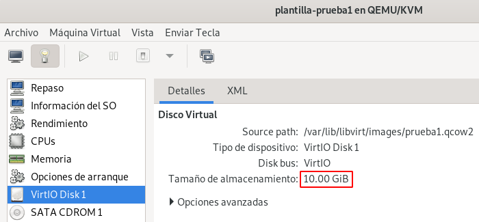

# Clonación ligera a partir de plantillas

En este tipo de clonación la imagen de la máquina clonada utiliza la imagen de la plantilla como imagen base (**backing store**) en modo de sólo lectura, en la imagen de la nueva máquina sólo se guardan los cambios del sistema de archivo. Requiere menos espacio en disco, pero no puede ejecutarse sin acceso a la imagen de plantilla base. Podemos entender esta técnica como aprovisionamiento ligero** ya que en un principio la imagen de la nueva máquina no ocupara nada en el disco e irá creciendo con las modificaciones que vayamos haciendo a la máquina.

## Creación de imágenes de disco con backing store

Para simplificar la creación de este tipo de imágenes vamos a poner como tamaño el mismo que tenga la imagen base de la plantilla. Esto es debido a que como la imagen base ya tiene guarda un sistema de archivo con un tamaño de terminado, el hecho de que creemos una nueva imagen con más tamaño no conllevará el redimensionado del sistema de archivo. Este cambiod e tamaño se podría realizar pero con operaciones un poco más compleja.

Para asegurar de crear un volumen del mismo tamaño que la imagen base vamos asegurarnos de su tamaño:
```
virsh -c qemu:///system domblkinfo plantilla-prueba1 vda --human
Capacidad:      10,000 GiB
...
```

También lo podemos ver con `virt-manager`:




Conación ligera

Crear volukmen con backing store

virsh -c qemu:///system vol-create-as default clone2.qcow2 10G --format qcow2 --backing-vol prueba1.qcow2 --backing-vol-format qcow2 


sudo qemu-img create -f qcow2 prueba6.qcow2 10G -b template-debian.qcow2

Con virt-manager

Y volvemos a crear una mv


