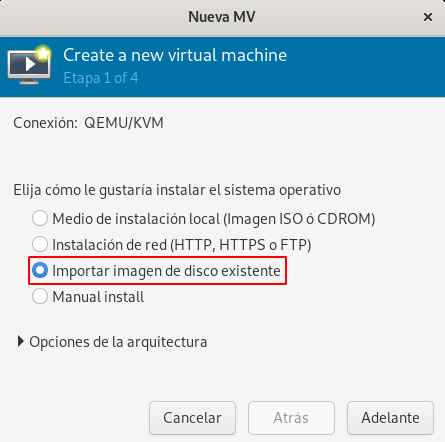
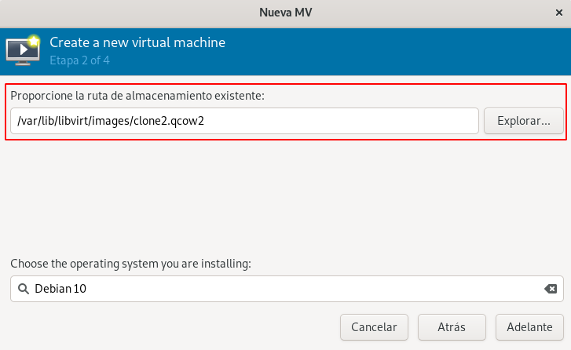

# Clonación ligera a partir de plantillas

En este tipo de clonación la imagen de la máquina clonada utiliza la imagen de la plantilla como imagen base (**backing store**) en modo de sólo lectura, en la imagen de la nueva máquina sólo se guardan los cambios del sistema de archivo. Requiere menos espacio en disco, pero no puede ejecutarse sin acceso a la imagen de plantilla base. Podemos entender esta técnica como aprovisionamiento ligero** ya que en un principio la imagen de la nueva máquina no ocupara nada en el disco e irá creciendo con las modificaciones que vayamos haciendo a la máquina.

## Creación de imágenes de disco con backing store

Para simplificar la creación de este tipo de imágenes vamos a poner como tamaño el mismo que tenga la imagen base de la plantilla. Como la imagen base ya tiene guardado un sistema de archivos con un tamaño determinado, el hecho de que creemos una nueva imagen con más tamaño no conllevará el redimensionado del sistema de archivo. Este cambio de tamaño se podría realizar, pero con operaciones un poco más compleja.

Para asegurarnos de crear un volumen del mismo tamaño que la imagen base vamos comprobar su tamaño:
```
virsh -c qemu:///system domblkinfo plantilla-prueba1 vda --human
Capacidad:      10,000 GiB
...
```

También lo podemos ver con `virt-manager`:


Para crear la nueva imagen basada en la imagen base de la plantilla, podemos crear el volumen con `virsh`:

```
virsh -c qemu:///system vol-create-as default clone2.qcow2 10G --format qcow2 --backing-vol prueba1.qcow2 --backing-vol-format qcow2 
```

O podemos usar la aplicación `qemu-img` y posterior refrescamos el pool `default`:

```
cd /var/lib/libvirt/images
sudo qemu-img create -f qcow2 prueba6.qcow2 10G -b template-debian.qcow2
virsh -c qemu:///system pool-refresh default
```

Otra opción es usando `virt-manager`, creando un nuevo volumen e indicando durante la dirección el volumen base:


## Uso virt-clone para realizar la clonación ligera

Una vez que tenemos creado el volumen basada en el imagen base de la plantilla, podemos crear un nuevo clon con `virt-clone`, para ello ejecutamos:

```
virt-clone --connect=qemu:///system --original plantilla-prueba1 --name clone2 --file /var/lib/libvirt/images/clone2.qcow2 --preserve-data
```

Indicamos como fichero el volumen que hemos creado, pero con la opción `--preserve-data` no se copia el volumen original al nuevo, simplemente se usa. Se puede comprobar que la clonación no tarda nada de tiempo, no se está copiando un volumen en otro.

## Uso virt-manager para realizar la clonación ligera

Con `virt-manager` no podemos hacer una clonación ligera desde el volumen que hemos creado. No nos permite elegir la opción de no realizar la copia del volumen de la plantilla al volumen de la máquina que estamos creando.

Como alternativa, lo que podemos hacer es crear una nueva máquina virtual con el volumen que hemos creado.

Podemos hacerlo como estudiamos en el apartado *Trabajar con volúmenes en las máquinas virtuales*, eligiendo la opción **Manual install** al crear la máquina y posteriormente seleccionando el volumen de la nueva máquina.

Otra forma, sería es cogiendo la opción **Importar imagen de disco existente** en la creación de la máquina:



Y eligiendo el volumen en siguiente paso:



