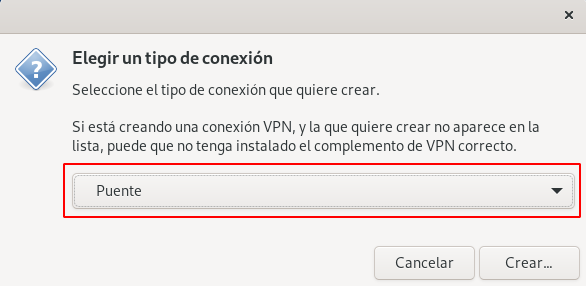
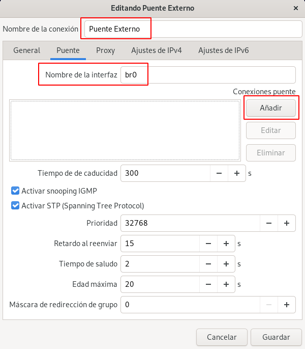
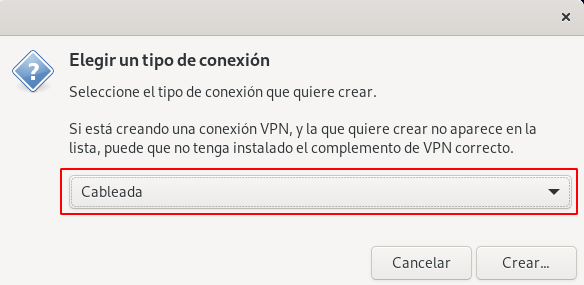
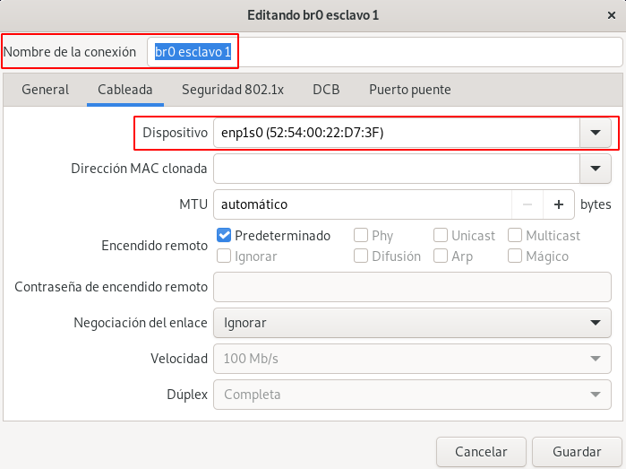
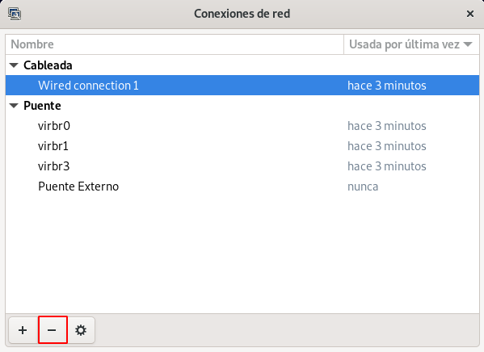
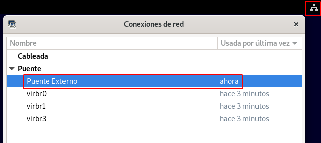

# Creación de un Puente Externo con Linux Bridge

Un bridge externo es un bridge virtual que estarán conectada al router de la red local. El bridge se creará en el servidor donde estamos virtualizando (host). El host estará conectado a este bridge para tener conectividad al exterior. Veamos un esquema:


* El bridge que vamos a crear lo vamos a llamar `br0`.
* En el host aparecerá una interfaz de red con el mismo nombre que representa la conexión al bridge. Está interfaz de red se configurará de forma estática o dinámica (si la red local tiene un servidor DHCP).
* En el ejemplo vemos que la interfaz física de red es `eth0` que estará conectada a `br0` para que el host tenga conectividad al exterior. Esa interfaz de red no tendrá asignada dirección IP.
* Posteriormente veremos como podemos conectar las máquinas virtuales a este bridge de tal manera que tomaran direcciones IP en el mismo direccionamiento que el host.

**Nota: Si conectamos al bridge una interfaz de tipo wifi podemos tener problemas de conectividad. No todas las tarjetas inalámbricas permiten la conexión a punetes virtuales.**

No aseguremos que tenemos instalado el siguiente paquete que nos permite trabajar con Linux Bridge:

```
apt install bridge-utils
```

## Creación de un bridge externo con NetworkManager

**NetworkManager** es una utilidad de gráfica para simplificar el uso de redes en sistemas Linux. Normalmente la tenemos instaladas con sistemas Linux con entornos gráficos como Gnome. Junto a esa utilidad tenemos otra que se puede ejecutar con el comando `nm-connection-editor`, y que se llama **Configuración avanzada de redes**:


Si lo ejecutamos accedemos a la siguiente pantalla:


Donde vemos la conexión de red cableada (o de wifi) que tenemos y los bridge virtuales que se han creado cuando hemos estado trabajando con las redes en libvirt. Pulsando el botón +, podemos de alta nueva conexión. Añadiremos una conexión de tipo **Puente**:



Y podemos indicar el nombre de la conexión, el nombre del puente que estamos creando, y a continuación vamos a añadirle una conexión al bridge que será la interfaz de red física del host que está actualmente conectada al exterior.



Añadimos un conexión **Cableada** que será la interfaz física del host (en mi caso `enp1s0`):





Finalmente borramos la conexión cableada que tenemos actualmente:



Y en unos segundos, se conectará de forma automática a la conexión **Puente Externo**:

 

Comprobamos la configuración de red del host:

```
$ ip a
2: enp1s0: <BROADCAST,MULTICAST,UP,LOWER_UP> mtu 1500 qdisc pfifo_fast master br0 state UP group default qlen 1000
    link/ether 52:54:00:22:d7:3f brd ff:ff:ff:ff:ff:ff
...
7: br0: <BROADCAST,MULTICAST,UP,LOWER_UP> mtu 1500 qdisc noqueue state UP group default qlen 1000
    link/ether 92:d8:69:79:60:69 brd ff:ff:ff:ff:ff:ff
    inet 192.168.121.168/24 brd 192.168.121.255 scope global dynamic noprefixroute br0
       valid_lft 3459sec preferred_lft 3459sec
...
```

Comprobamos que la interfaz física `enp1s0` no tiene dirección IPP, ya que está conectada al bridge. La interfaz de red `br0` representa la conexión del bridge que ha tomado una ip del servidor DHCP de la red local (esta dirección IP será diferente a la que tenía anteriormente la interfaz física).

Si tenemos instalado el paquete `bridge-utils` podremos ver los puentes virtuales y las interfaces que tienen conectadas, ejecutando como superusuario:

```
brctl show
bridge name	bridge id		STP enabled	interfaces
br0		8000.92d869796069	yes		enp1s0
virbr0		8000.525400aea33d	yes		
virbr1		8000.5254002daec2	yes		
virbr3		8000.52540052838e	yes
```

## Creación de un bridge externo en Debian

Si estamos trabajando en un servidor con Linux Debian instalado y no tenemos instalado NetworkManager, la configuración se hará directamente en el fichero de configuración de red `/etc/network/intefaces`:

```
auto lo
iface lo inet loopback

auto enp1s0
iface enp1s0 inet manual

auto br0
iface br0 inet dhcp
        bridge-ports enp1s0
```

Donde vemos como hemos configurado la interfaz física `enp1s0` de tipo `manaual` para que no tome direccionamiento. Además hemos declarado nuestro puente `br0` para que tome direccionamiento de forma dinámica y hemos indicado que tendrá una interfaz conectada (`bridge-ports`) que será la física (`enp1s0`).

Finalmente, reiniciamos la red como superusuario:

```
ifdown enp1s0
systemctl restart networking.service
```

Y comprobamos:

```
ip a
...
2: enp1s0: <BROADCAST,MULTICAST,UP,LOWER_UP> mtu 1500 qdisc pfifo_fast master br0 state UP group default qlen 1000
    link/ether 52:54:00:22:d7:3f brd ff:ff:ff:ff:ff:ff
3: br0: <BROADCAST,MULTICAST,UP,LOWER_UP> mtu 1500 qdisc noqueue state UP group default qlen 1000
    link/ether 92:d8:69:79:60:69 brd ff:ff:ff:ff:ff:ff
    inet 192.168.121.169/24 brd 192.168.121.255 scope global dynamic br0
       valid_lft 3595sec preferred_lft 3595sec
```

## Creación de un bridge externo en Ubuntu

En Ubuntu vamos a configurar el fichero `/etc/netplan/01-network-manager-all.yaml` de la siguiente forma:

```
# Let NetworkManager manage all devices on this system
network:
  version: 2
  renderer: networkd
  ethernets:
    enp1s0:
      dhcp4: no
  bridges:
    br0:
      dhcp4: yes
      interfaces:
             - enp1s0
```

Y reiniciamos la red ejecutando:

```
sudo netplan apply
```
