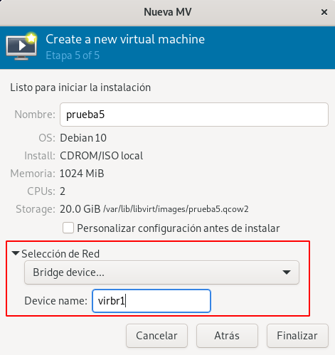

# Configuración de red en las máquinas virtuales

Todas las máquinas que hemos creado durante el curso se han conectado de forma predeterminada a la red `default`. 

Sin embargo, en este apartado vamos a aprender algunas cosas nuevas: a crear máquinas virtuales conectadas a otras redes definidas por el usuario y a añadir interfaces de red a máquinas virtuales ya existentes.

## Crear máquinas virtuales conectada a una red existente

Para crear una máquina virtual conectada, por ejemplo, a la red `red_nat`, podemos usar `virt-install`:

```
virt-install --connect qemu:///system \
			 --virt-type kvm \
			 --name prueba5 \
			 --cdrom ~/iso/debian-11.3.0-amd64-netinst.iso \
			 --os-variant debian10 \
			 --network network=red_nat \
			 --disk size=10 \
			 --memory 1024 \
			 --vcpus 1
```

* Con la opción `--network network=red_nat` indicamos que la máquina tendrá una interfaz de red conectada a la red cuyo nombre es `red_nat`.
* Para conectar una máquina a una red también podemos indicar el bridge virtual al que queremos conectarla. en este caso utilizaríamos la opción `--network bridge=virbr1`. `vribr1` era el bridge virtual que gestiona la red `red_nat`.
* Si indicamos varios parámetros `--network`, estaríamos añadiendo a la nueva máquina varias interfaces de red.

Si utilizamos `virt-manage`r, para crear la nueva máquina, durante el asistente de creación de la máquina, el el último paso, podemos escoger la red a la que nos vamos a conectar:


También podemos escoger el puente virtual al que nos queremos conectar:



## Añadir nuevas interfaces de red a máquinas virtuales
